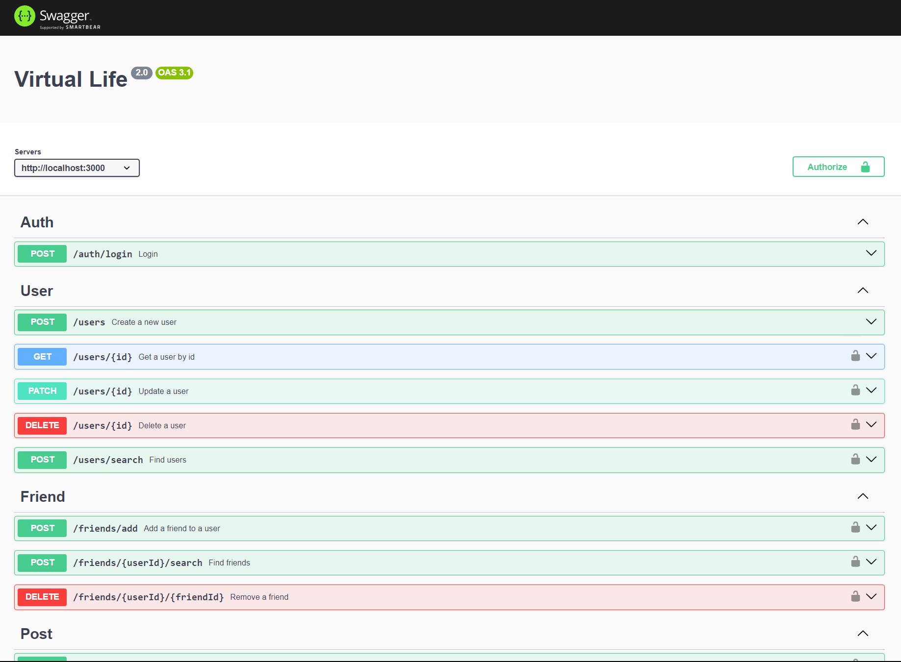

# Virtual Life 2.0

- [Live](http://18.208.246.233:3000/api-docs/) on AWS!
- Improving on my prev [virtual-life-1.0](https://github.com/muhammadihabk/virtual-life-1.0), this social network backend api aims at improving in all aspects even the cleaner more quality code. Check [Phases](#phases) 👇.
- Designed with frontend phase in mind, giving convenient endpoints for features like homefeed, add comments and replies and see their authors and reactions count, ...

# Phases

- [x] Gather app requirements and build Database
- [x] Build the API
- [x] API Validation using [joi validator](https://joi.dev/api/?v=17.13.0)
- [x] API documentation using Swagger and OpenAPI
- [x] User authentication and authorization using Passport.js
- [x] Add E2E tests using Jest
- [x] Dockerize
- [x] Deploy to AWS
- [ ] Migrate to NestJS and Typescript
- [ ] Chat and WebSockets?

# Decisions

## Write Once, Use Anywhere

- Mainly the [config](config) folder has configuration for every new too ex. db and knex, auth and passport, tests and jest, api documentation and swagger, validation and joi, ...
- Ex. At [utilities.test.js](config/test/utilities.test.js), I've implemented the `beforeEachTest` method which cleans the databse, seed data, login w/ a user and update jest `global` object w/ the token for subsequent tests.
- Ex. In API documentation, wrote 1 main yaml file, and each new component has it's own yaml file, on launching swagger page, all files are combined into 1 and [passed to Swagger UI](config/openapi/openapi.config.js)

## More decisions

- **User - Friend relationship integrity**\
  A user could have many friends, relation is a many-to-many users table. To be sure rows are not repeated
  ex. in a row: userId=1, friendId=2 then in another row: userId=2, friendId=1, the [repository layer](src/components/friend/friend.repository.js#addFriendRepository) maintains
  the smaller id number always to be in the userId column. No this could have been done throw a MySQL trigger. But I assume adding friends is a frequent request to the server. and SQL triggers
  are a performance overhead. Idea is to then keep such logic in the repository layer. But the catch is, as the app grows in the future, this repositry layer has to stay the only door to the databse. i.e all communication done to the databse has be through this repository layer. Like a DB server.
- **Reaction table doesn't reference post or comment by id**\
  A reaction is always assigned to 1 kind of activity (post or comment),
  so each row will always have empty column in 1 of the activities if each has it's own foreign key.
  Instead I use `activityKind` column. This solution comes w/ a trade off that we can't delete cascade post/comment and reactions but that's a positive trade to
  maintain history of the whole app. Such data could be helpful in future analytics and useful insights to better understand the app's audiences' behaviors and needs.

- **Maintenance Note**\
  All components (user, post, ...) OpenAPI files are combined into 1 object and passed to swagger ui. So in each component OpenAPI file, you should always reference objects when needed rather than other YAML files. If you needed to create variables for your component, follow this format: `x-<componentName>-variables`. Each time you create a new OpenAPI file, you should update `config/openapi/openapi.config.js` accordingly.

# Usage

- Run `src/auth/lib/generateKeyPair.js` and copy keys to `PRIVATE_KEY` and `PUBLIC_KEY` variables in .env
- Create corresponding `docker-compose-development.yaml` environment variables in .env
- On windows, run `docker compose -f docker-compose-development.yaml up`
- Navigate to http://localhost:3000/api-docs/
- Simply hit `/auth/login` (no need to edit the body, it's a valid user) or `/users` to get a token for authentication and now you can explore other endpoints.
